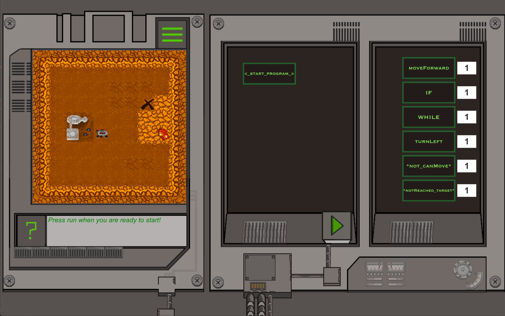
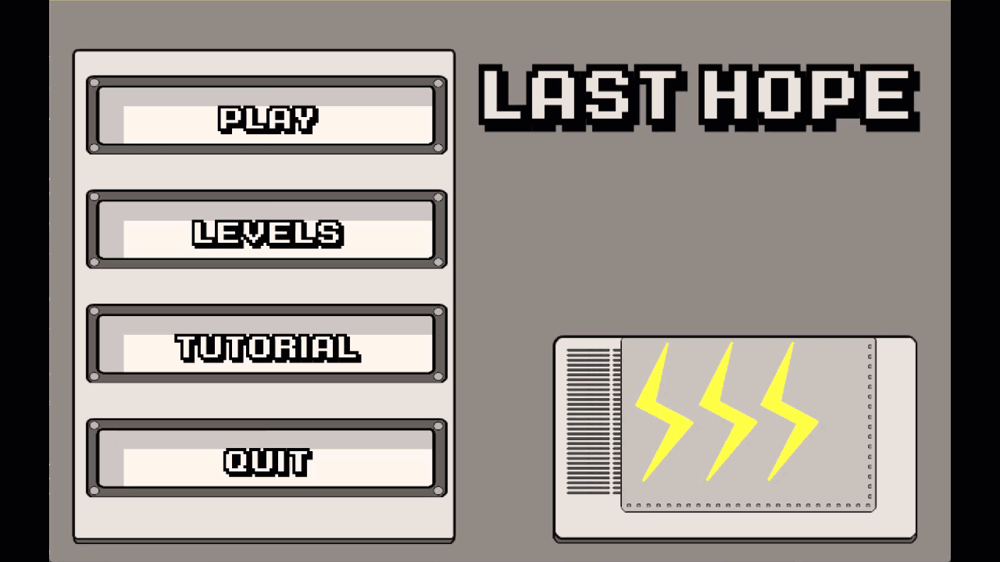
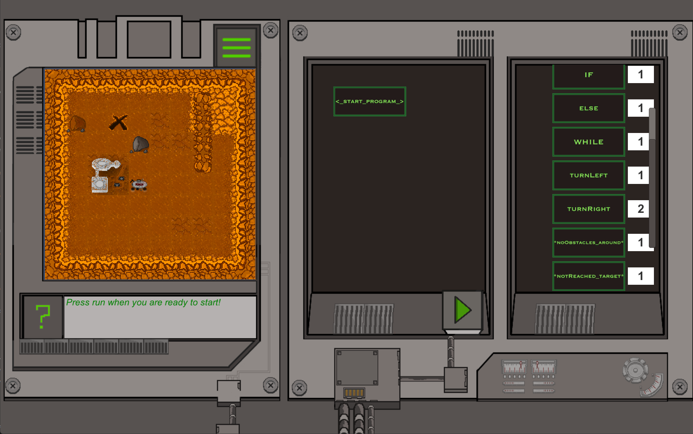

# Last Hope (Teaching Coding through Gaming)

Last Hope is a gaming-based code-learning framework. It's a Unity game I made for youngsters aged 12-19 to teach them coding while exploring the "Red Planet" in a NASA Mars rover. The framework was designed and made in support of the UK Government's Coding Curriculum school initiative.

The objective was to construct a viable and scalable educational framework with future extension capabilities that can be used by secondary school students to learn programming on their own. At the same time, the aim is to also inspire them to do so by delivering entertaining teaching material in a interactable format for those taking the first steps in programming.

## Specifications

**Materials, equipment and software required to create the game:** C# programming language, Unity3D Engine, Adobe Photoshop, Microsoft Visual Studio, Microsoft VS Code and other ancillary software (Git, Concepts, Todoist).

**Hardware and software minimum specifications required to run the game:** A computer running either Windows XP SP2+ or Mac OS X 10.8+ with a graphics card that supports DirectX 9+ (for Windows) or OpenGL 1.4+ (for Mac).

## Game Design & Mode of Play

The learning framework project is built on top of the Unity3D platform and it is practically a game in which the player is making use of code blocks to move a character around and do certain tasks.

No matter how distinct programming languages are, they all are based on the same concepts:

1. Functions to perform a certain action
2. Conditional statements to perform an action only if something is true
3. Loops, which help to set up iterative processes

The player is able to use each one of these elements to help the mars explorer, named "Last Hope" (as it is the last hope for humanity to explore the "Red Planet" in the game scenario) to reach his target - a place from which it will be able to move on to more adventures.

Full use is being made of the graphical interface to help the player visualise programming concepts that might sometimes be hard to understand for beginners. The game directly shows which processes occur when a program is executed. Additionally, the game illustrates the importance of these concepts, how programmers make use of them and the way through which at e programmer could improve efficiency of code.

As the user develops programming skills, the game introduces new programming statements that will make every next level more complex, but also more interesting and, therefore, more enjoyable. The difficulty is being increased with each level to develop a set of necessary skills for programming: from making correct assumptions to predicting the behaviour of the character.

## Project Status

### Completed Tasks

* [X] Created a simulated compiler that "compiles" the code blocks and transforms them into "machine code" (C# code running as scripts inside Unity3D)
* [X] Core functionality of the game with a possibility of easily adding more functionality and extending the game

  * [X] Basic set of code blocks which can be used by the user to complete the levels.
  * [X] Drag & drop functionality
  * [X] Added the option to preview changes to the code
  * [X] Added the option to delete and reorder blocks and sets of blocks
  * [X] Added movement events (e.g. reached final destination, fell into lava pool etc.)
  * [X] Added the option to limit the number of times that the user can place a certain code block so that he is forced to create more intelligent and shorter programs
* [X] Added an in-game console which displays messages, warnings and errors from the pseudo-compiler
* [X] Designed an attractive GUI for the game
* [X] Made the game screen and its content to properly rescale depending on the
  screen size and aspect ratio
* [X] Created 11 levels that the user can access with the possibility of easily adding more levels
* [X] Added the option to save the user's game progress and the option for the user to navigate between previously completed levels
* [X] Created in-game tutorials for each level
* [X] Added in-game hints and information showed on pop-up on each level.
* [X] Project documentation
* [X] Project advertising
* [X] Done repetitive testing and bug-fixing

### Outstanding tasks

* [ ] Add the option for the user to debug the code step by step
* [ ] Add the option to convert the "program" made out of code blocks into a C#/Java program to teach the more advanced users how that code would translate into an actual programming language
* [ ] Add more types of blocks (e.g. do while(), break(), continue(), jump())
* [ ] Add more levels with bigger maps
* [ ] Some bug-fixing still required
